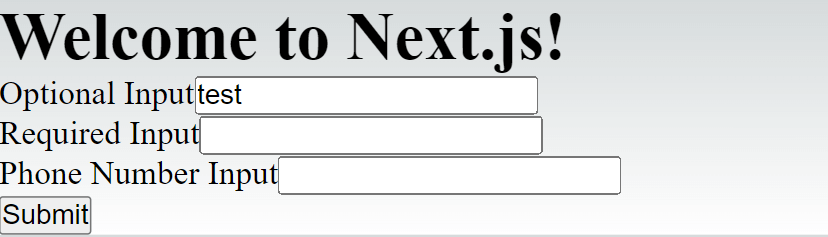
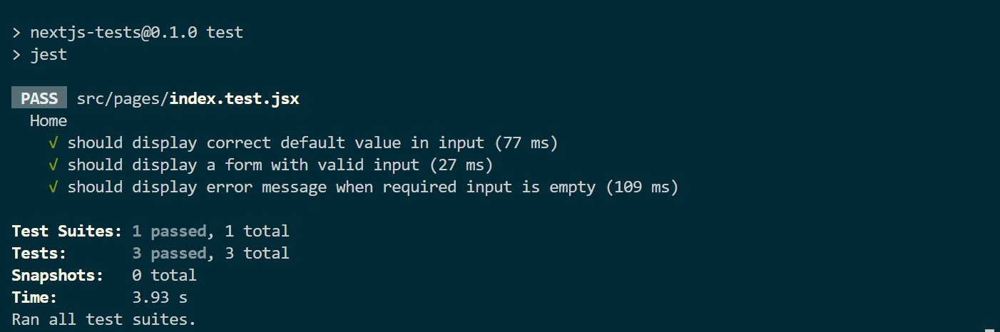

[Tests](https://guruspedia.com/staging-vs-test-environments-whats-the-differences) are used to describe the expected behavior of a piece of code. Writing tests for your code allows you to ensure applications behave the way we want them to. A written test also tells you if you have accidentally broken something based on how your application should function. This way, you can any errors and bugs in the design structure and the functionality of your application.
<!--more-->

One of the common testing methodologies is unit testing. Unit testing is used to evaluate small units of code, and each component is tested individually. Unit testing isolates these small units to determine if a component passes requirements based on the application behaviors.

One of the best frameworks that you can use to carry out the test is Jest. Jest is a JavaScript-based testing framework. In this guide, you will learn how to carry out unit testing for Next.js [React based](https://guruspedia.com/how-to-setup-internationalization-in-reactjs-using-react-18next/) apps using the Jest testing framework.

### Set up a Next.js app

This guide will use the npx command to bootstrap a Next.js app. Npx is an npm package runner. It provides easy ways to manage any dependencies that the npm registry has.

Open the terminal that points to your project directory and run the following command to initialize the application:

```bash
npx create-next-app nextjs-tests-with-jest --use-npm
```

If you are using Yarn add the `--use-npm` flag with `--use-yarn` to the above command.

After the process is done, proceed to the newly created directory:

```bash
cd nextjs-tests-with-jest
```

Start the Next.js development server:

```bash
npm run dev
```

Finally, open `http://localhost:3000` to view the newly created application.

### Set up Jest in Next.js app

Once the Next.js app is ready, you need to configure Jest to carry out the test on your application. To do this, first, install the following Jest dependencies as well as supertest, for testing HTTP server with fluent API.

```bash
npm install -D jest @testing-library/react jest-environment-jsdom @testing-library/jest-dom supertest
```

The above testing libraries are used for development purposes. Therefore, add a `-D` to save these dependencies as devDependencies of your project.

Once you have them installed, go ahead and create a `jest.config.js` at the root directory of your project. This file will host the Jest configuration as follows:

- Add `nextJest`, which you will require to run and get methods needed to create jest configurations.

```js
const nextJest = require("next/jest");
```

- To load Next.js to the Jest configuration, specify the root directory of the Next.js app; add:

```js
const createJestConfig = nextJest({
   dir: "./",
});
```

- Pass in your own options object for Jest as shown below:

```js
const customJestConfig = {
  // clear the mocks from test runs
   clearMocks: true,
   // files to skip when running the tests
   testPathIgnorePatterns: ['<rootDir>/.next/', '<rootDir>/node_modules/'],
   // any file extensions that should be included in the tests
   moduleFileExtensions: ["js", "jsx"],
   // The test environment that will be used for testing
   testEnvironment: 'jest-environment-jsdom',
   // Add the paths to save your tests
   setupFilesAfterEnv: ['<rootDir>/src/pages/test.js'],
};
```

- Finally, export the result in this config file

```js
module.exports = createJestConfig(customJestConfig);
```

The Jest is now configured. Next, add the Jest command to the `package.json` file to run the test script to execute Jest. Add the following script to execute Jest. This will allows us to run a simple Node.js command that runs all the tests written in our Next.js application.

```bash
"scripts": {
"test": "jest",
},
```

To set up these tests, go ahead and create a `jest.setup.js` file inside the root directory of the Next.js app and import the following testing library for Jest:

```js
import "@testing-library/jest-dom";
```

At this point, your Next.js and Jest test environment is ready to carry out tests.

### Create a Next.js app

To run a test, create a Next.js app that you want to test. In this example, use the following basic example:

- Install the [React Hook Form](https://react-hook-form.com/) library to your app. We will create a very simple form here. This library simplifies how you build forms using Next.js or any React-based application

```bash
npm i react-hook-form
```

It is not limited that you can only use a form to run the test. Were are using this for demonstration purposes. Any Next.js component can be integrated with Jest to run any tests that suit that component.

- Import the `react-hook-form` library to the `pages/index.js` file:

```js
// we only need useForm in this example from the hook library
import { useForm } from "react-hook-form";
```

- Add this basic form to your Next.js app

```js
export default function Home() {
  const {
    // register your component to the hook for form submission
   register,
   // handle the submit functionality to the component
   handleSubmit,
   // add an error check to the form using the hook  error object
   formState: { errors },
  } = useForm();

  // handle the submit function on the form data
  const onSubmit = (data) => {
   console.log(data);
  };

  // render your form component to the web
  return (
   <div className="container">
    <h1>
     Welcome to <a href="https://nextjs.org">Next.js!</a>
    </h1>
    {/* validate your form input using the handleSubmit before submitting them using the onSubmit  */}
    <form onSubmit={handleSubmit(onSubmit)} className="formContainer">
     <div className="formGroup">
      <label>Optional Input</label>
      <input name="testInput" defaultValue="test" data-testid="testInput" />
     </div>

     <div className="formGroup">
      <label>Required Input</label>
      {/* register the form inputs to the hook  */}
      <input
       {...register("testRequiredInput", {
        required: "This field is required",
       })}
      />
      {errors?.testRequiredInput && (
       <p>{errors.testRequiredInput.message}</p>
      )}
     </div>

     <div className="formGroup">
      <label>Phone Number Input</label>
      <input data-testid="phoneInput" />
     </div>

     <button type="submit" data-testid="submitBtn" className="submitBtn">
      Submit
     </button>
    </form>
   </div>
  );
}

```

You can re-run your application to test if this works as expected:

```bash
npm run dev
```



### Carry out tests

Let's now carry out a test on this application using Jest. First, create an `index.test.jsx` file inside the `pages` directory.

- Import the render, fireEvent, act, and waitFor from the testing library. This can include any parameter you want to use to carry out a test. Check more in this [guide](https://testing-library.com/docs/react-testing-library/cheatsheet). Also, import jest-dom so that the testing library can use DOM Jest testing-library to your `index.test.jsx` file as follows:

```js
import { render, screen, fireEvent, act, waitFor } from '@testing-library/react'
// add jest
import '@testing-library/jest-dom'
```

- Import the component that you to test. This can be any component you have created for your application. In this case, use the `Home` component, which is hosted in the `index.js` file:

```js
import Home from './index'
```

- Test Suites: A test [suites](https://jestjs.io/docs/api###describename-fn) creates a block of tests that are related to each other. In this case, use the function `describe()` to group the tests

```js
describe('Home', () => {
})
```

Once you have this set, add the test you want to run inside the above `describe()` method. To write your whole test tests use the `test()` method. as shown below: Note this `test()` method runs inside the `describe()` method.

- Test1: The first test case will be to ensure that every single component is rendered onto the page correctly:

```js
test("should display correct default value in input", () => {
   const { getByTestId } = render(<Home />);
   expect(screen.getByTestId('testInput')).toBeInTheDocument()
   expect(screen.getByTestId('submitBtn')).toBeInTheDocument()

});
```

Here use the `getByTestId` rule to access the Text Input and the Button. There are many ways to set test rules. These rules are called [queries](https://testing-library.com/docs/react-testing-library/cheatsheet###queries). Check this guide to determine [which query you should use](https://testing-library.com/docs/queries/about/###priority).

- Test2: This check is the displayed form has a value that matches what you want to be filled in this form. In this case, the default value is set to test. You can actually test that by running this test case:

```js
test("should display a form with valid input", () => {
   const { getByTestId } = render(<Home />);

   fireEvent.input(getByTestId("testInput"), {
     target: {
       value: "test"
     }
   });
});
```

- Test3: Finally, run a test to check if the submit button is executing when the component has the required values

```js
test("should display error message when required input is empty", async () => {
   const { getByTestId, findByText } = render(<Home />);

   act(() => {
     fireEvent.click(getByTestId("submitBtn"));
   })

   await waitFor(() =>
     findByText("This field is required")
   )
})
```

The complete code file should be as follows:

```js
import { render, screen, fireEvent, act, waitFor } from '@testing-library/react'
// add jest
import '@testing-library/jest-dom'
import Home from './index'

describe('Home', () => {

    test("should display correct default value in input", () => {
        const { getByTestId } = render(<Home />);
        expect(screen.getByTestId('testInput')).toBeInTheDocument()
        expect(screen.getByTestId('submitBtn')).toBeInTheDocument()

    });


    test("should display a form with valid input", () => {
        const { getByTestId } = render(<Home />);

        fireEvent.input(getByTestId("testInput"), {
            target: {
                value: "test"
            }
        });
    });

    test("should display error message when required input is empty", async () => {
        const { getByTestId, findByText } = render(<Home />);

        act(() => {
            fireEvent.click(getByTestId("submitBtn"));
        })

        await waitFor(() =>
            findByText("This field is required")
        )
    })
})
```

To check if these tests, run the following command inside the Next.js project directory:

```bash
npm test
```

As you see, the test passed as expected. This component is executed correctly. These tests show you how your components are being rendered to the user.



Now that you have mastered How to Test Next.js Applications with Jest, why not dive deeper and take your Next.js testing skills to new heights and learn [Testing environments vs Staging environments](https://guruspedia.com/staging-vs-test-environments-whats-the-differences) and how to use them? You will love it.

### Conclusion

There are many tests you can run for your application. The above tests should help you understand how to set up and run the test for Next.js apps.

That’s all for this guide. I hope you found it helpful!
