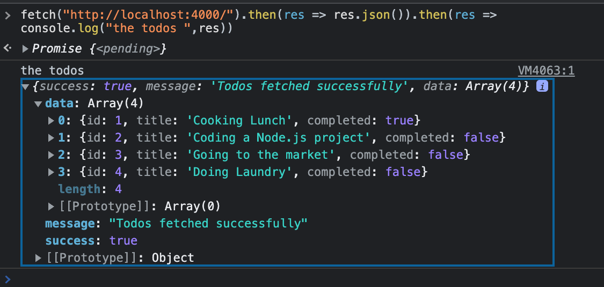

CORS (Cross-Origin Resource Sharing) is a security feature implemented by web browsers to block web pages from requesting a different domain not similar to the web page domain. Its purpose is to prevent malicious websites from accessing sensitive information, such as user authentication credentials.
<!--more-->

Let's say you have a web app accessed from `example.com`. This app requests the server domain `api.example.com` to fetch data. In this case, the browser will block server requests. This happens because the server using the domain `api.example.com` does not explicitly allow `example.com` to access its resources. This will result to CORS errors. To allow the exchange of resources, you need to set up the appropriate headers in the server's response. These headers indicate which cross origins are allowed to access the server's resources.

To deeply understand this concept, in this article, you will go through how to implement CORS in a Node.js server.

### Prerequisites

To continue in this article, it is helpful to have the following:

- [Nodejs](https://nodejs.org/en/) installed on your computer.
- Prior experience working with JavaScript.

### Setting up the Application

Launch the terminal from your preferred directory and run the following command to initialize a Node.js project:

```bash
npm init -y 
```

Along this guide, you will use the following dependencies:

- Express: For starting and handling the web server.
- CORS: For handling cross-origin access headers.
- Nodemon: For starting the development server.

Install the above dependencies by running the following two separate commands:

```bash
npm i express cors
```

```bash
npm i --save-dev nodemon
```

In your `package.json` file, add a script for starting the development server using Nodemon as follows:

```js
{
    "dev":"nodemon app.js"
}
```

Create an `app.js` file that will host the application configurations and logic:

```js
touch app.js
```

### Implementing a Todos Route

To comfortably understand this concept, you will need to create a basic application. A todos example will be a perfect use case here. Go ahead and create it as follows:

Navigate to the `app.js` file and add the following changes:

- Import the necessary packages:

```js
const express = require('express');
const cors = require('cors');
```

- Initialize the express application:

```js
const app = express();
```

- Define the port where the application will be running on:

```js
const PORT = process.env.PORT || 4000;
```

- Define an array with the todos for the Node.js app:

```js
const todos = [
    {
        "id":1,
        "title":"Cooking Lunch",
        "completed":true
    },
    {
        "id":2,
        "title":"Coding a Node.js project",
        "completed":false
    },
    {
        "id":3,
        "title":"Going to the market",
        "completed":false
    },
    {
        "id":4,
        "title":"Doing Laundry",
        "completed":false
    }
];
```

- Define a *GET* route for fetching and returning the todos:

```js
app.get('/', (req,res) => {
    return res.json({
        success:true,
        message:"Todos fetched successfully",
        data:todos
    })
});
```

- Start the application:

```js
app.listen(PORT, () => console.log(`App started and running on PORT ${PORT}`));
```

### Fetching Todos without Whitelisting an Origin

First, start the Node.js development server using the following command:

```bash
npm run dev
```

Go to `https://www.google.com/` and open the developer console from there. In the developer console, do a fetch request to get the todos as below:

```js
fetch("http://localhost:4000/").then(res => res.json()).then(res => console.log("the todos ", res));
```


This means you are using `https://www.google.com/` as the origin, sending the request to the server on the `http://localhost:4000/` server domain.


However, these are two different origins. Based on CORS policy, the server will reject the request to fetch the data to the `https://www.google.com/`. This is where the concept of CORS comes in handy.

The above response states that the origin `https://www.google.com` is not whitelisted to get the todos. Let's whitelist it in the next step and see the result.

### Whitelisting the Origin

Navigate to your `app.js` file. You now need to add the origin and whitelist so that the server can be able to share resources with it. The following examples should how to whitelist the `https://www.google.com` origin on the server:

```js
app.use(cors({
    origin:"https://www.google.com"
}))
```

Rerun the fetch on the console for `https://www.google.com`. At this point, this origin has access to the CORS header. Thus, the security policy will allow it to get data from the server. Once you send the `fetch()` request using the browser console, the origin should now return the data as expected:


### Whitelisting Multiple Origins

Let’s say your API is accessed by different domains. This means you need to allow access to all the origins as needed. For example, if you send the `fetch()` request using a different domain, for example, `https://www.bing.com`, you will still receive the CORS error response.


Here is how you can add multiple origins that consume your server resources: In the `app.js` file, create an array of all the origins you want to whitelist as follows:

```js
const whitelisted_origins = ["https://www.google.com","https://www.bing.com"];
```

- Define the origins on cors:

```js
app.use(cors({
    origin:whitelisted_origins
})) 
```

Rerun the fetch on either of the whitelisted origins. Test the `fetch()` using `https://www.bing.com` and the error should be resolves



### Whitelisting All Origins

Likewise, you can make the resource public and allows all origins to access the APPI data. In this case, navigate to your `app.js` file and change the origin configurations for CORS as shown below:

```js
app.use(cors({
    origin:'*'
}))
```

Send the fetch request from the site. You should be able to get the todos regardless of the origin of sending the request.

### Conclusion

CORS can be a problem when developing web applications that request a domain other than the one serving the web app. In this case, the server must be configured to allow the client's origin to access its resources. This can be done by setting the appropriate headers in the server's response, such as `Access-Control-Allow-Origin`.

It's also good to note that CORS is a browser feature. It is not a feature of the HTTP server protocol itself. This means it's something you can handle when creating a server. However, when you create a client-side application that needs to connect to a server and is ruining on a different domain, you will need to enable CORS on the server to give the client access to resources.